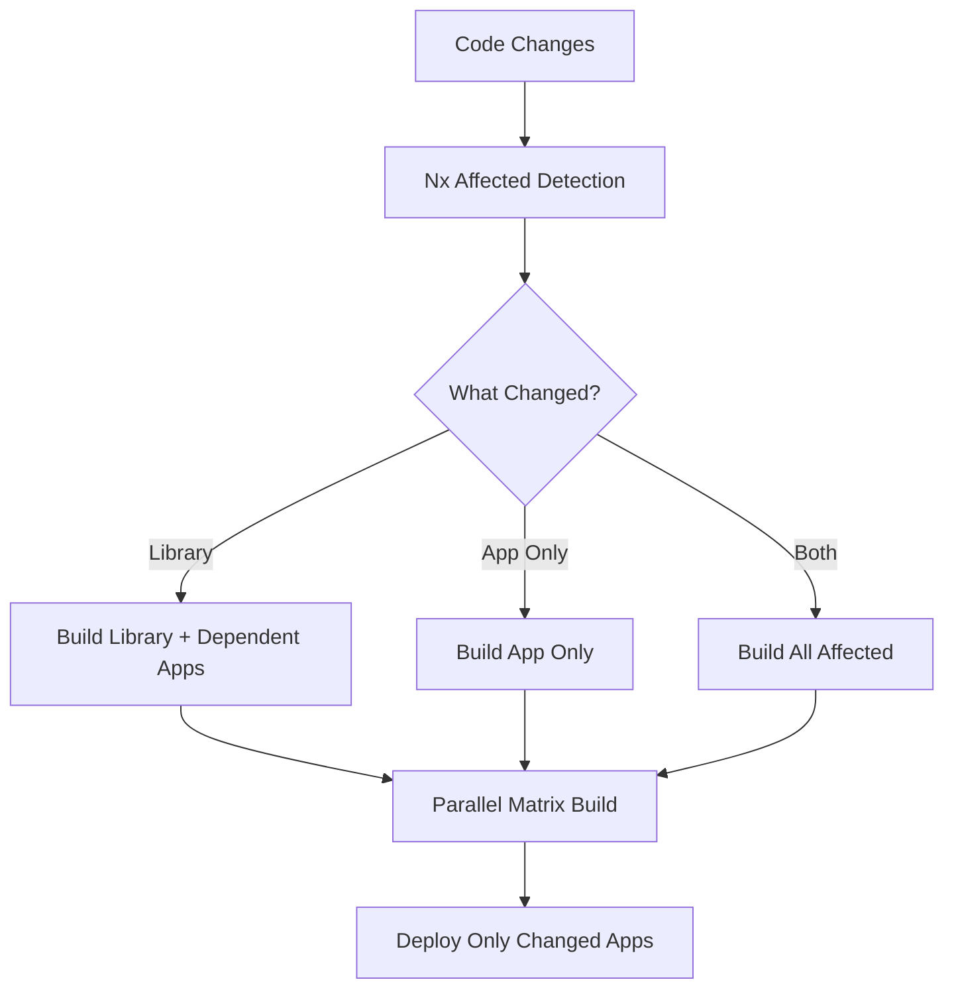

# CI/CD Strategy Overview

## How Changes Flow Through the Pipeline

This document explains how code changes flow through our CI/CD pipeline, from development to production deployment.

## 🔄 Change Flow Diagram

```
Developer Work → PR → Validation → CI → CD → Staging → Production
     ↓           ↓        ↓        ↓     ↓      ↓         ↓
   Local      PR Checks  Build   Deploy  Auto   Manual   Live
   Testing    & Tests    & Test   Artifacts  Deploy  Approval  App
```

## 📋 Pipeline Stages

### 1. Development & Local Testing
- **Developer** makes changes locally
- **Nx** helps identify affected projects: `npx nx affected:graph`
- **Local testing** ensures changes work before pushing

### 2. Pull Request Creation
- **Branch** created from `main` or `develop`
- **PR** opened with semantic title (feat:, fix:, docs:, etc.)
- **Automatic triggers**:
  - PR validation workflow (`pr.yml`)
  - CI workflow (`ci.yml`)

### 3. PR Validation (`pr.yml`)
**Purpose**: Early quality gates before code review

**Checks**:
- ✅ **Semantic PR title** validation
- ✅ **Merge conflict** detection
- ✅ **Dependency vulnerability** scanning
- ✅ **Code quality** checks (Nx linting)
- ✅ **PR size** warnings

**Outcome**: Fast feedback on code quality issues

### 4. Continuous Integration (`ci.yml`)
**Purpose**: Build and test affected projects

**Process**:
1. **Change Detection**: PowerShell script uses Nx to identify affected projects
   ```powershell
   npx nx show projects --affected --base=main --head=PR_BRANCH --json
   ```

2. **Parallel Builds**: Only affected projects are built
   ```yaml
   strategy:
     matrix: ${{ fromJson(needs.detect-changes.outputs.matrix) }}
   ```

3. **Testing**: Run tests with coverage collection
4. **Artifact Publishing**: Prepare deployment artifacts
5. **Summary**: Generate comprehensive status report

**Key Benefits**:
- ⚡ **Incremental**: Only builds changed projects
- 🚀 **Parallel**: Multiple projects build simultaneously
- 💾 **Cached**: NuGet, Nx, and Node modules cached
- 📦 **Artifacts**: Ready for deployment

### 5. Continuous Deployment (`cd.yml`)
**Purpose**: Deploy applications to environments

**Triggers**:
- **Automatic**: Successful CI on `main` branch → Staging
- **Manual**: Manual dispatch for any environment

**Deployment Flow**:
1. **Change Detection**: Determine what apps changed
2. **Artifact Download**: Get build artifacts from CI
3. **Environment Deployment**: Deploy to target environment
4. **Health Checks**: Validate deployment success

**Environments**:
- **Staging**: Automatic deployment, no approval required
- **Production**: Manual approval required with environment protection

## 🎯 Smart Change Detection

### How Nx Determines What to Build



### Example Scenarios

**Scenario 1: Library Change**
```
Change: libs/Shared/EchoService.cs
Affected: Shared (library) + EchoAPI (depends on Shared)
Build: Both projects
Deploy: EchoAPI only (libraries aren't deployed)
```

**Scenario 2: App-Only Change**
```
Change: apps/EchoAPI/Program.cs
Affected: EchoAPI only
Build: EchoAPI only
Deploy: EchoAPI only
```

**Scenario 3: No Relevant Changes**
```
Change: README.md (documentation)
Affected: None
Build: Skip (no-changes scenario)
Deploy: Skip
```

## ⚙️ Configuration-Driven

### Centralized Configuration
All pipeline behavior controlled by configuration files:

**`.github/config/workflow-config.yml`**:
```yaml
dotnet:
  version: '8.0.x'
  build-configuration: 'Release'
deployment:
  environments:
    staging: 'staging'
    production: 'production'
```

**`.github/config/deployment-config.json`**:
```json
{
  "apps": {
    "echo-api": {
      "type": "webapi",
      "path": "apps/EchoAPI",
      "environments": ["dev", "staging", "prod"],
      "deployment": {
        "type": "azure-app-service"
      }
    }
  }
}
```

## 🚀 Efficiency Features

### Caching Strategy
- **NuGet Cache**: Global package caching across workflows
- **Nx Cache**: Build output caching with cross-workflow persistence
- **Node Modules**: Dependencies cached for faster setup

### Parallel Execution
- **Project-Level Parallel**: Independent projects build simultaneously
- **Matrix Strategy**: GitHub Actions matrix for multiple projects
- **Dependency-Aware**: Ensures proper build ordering

### Incremental Processing
- **Affected Projects Only**: Processes only changed projects
- **Smart Test Selection**: Runs tests based on change scope
- **Conditional Deployment**: Deploys only when necessary

## 🛡️ Quality & Security

### Quality Gates
- **Branch Protection**: Required status checks before merge
- **Code Review**: Mandatory PR reviews
- **Test Coverage**: Automated coverage reporting
- **Linting**: Code quality enforcement

### Security Measures
- **Dependency Scanning**: Automated vulnerability detection
- **CodeQL Analysis**: GitHub's semantic code analysis
- **Secret Management**: GitHub Secrets for sensitive data
- **Environment Protection**: Approval workflows for production

## 📊 Monitoring & Visibility

### Pipeline Status
- **Workflow Summaries**: Comprehensive status reports
- **Job Status Tracking**: Clear success/failure indicators
- **Artifact Management**: Build artifact tracking
- **Deployment Status**: Environment-specific deployment tracking

### Health Checks
- **Post-Deployment Validation**: Automated health checks
- **Rollback Capability**: Quick rollback mechanisms
- **Performance Monitoring**: Build time tracking

## 🔧 Key Benefits

### For Developers
- ⚡ **Fast Feedback**: Quick validation on PRs
- 🎯 **Focused Testing**: Only test what changed
- 📊 **Clear Visibility**: Comprehensive status reporting
- 🔄 **Consistent Process**: Standardized workflows

### For Operations
- 🚀 **Efficient Builds**: 60-80% reduction in build times
- 📦 **Reliable Deployments**: Consistent and reproducible
- 🛡️ **Quality Assurance**: Multiple quality gates
- 📈 **Scalable**: Ready for dozens of projects

### For Business
- ⏱️ **Faster Time to Market**: Reduced build and deployment times
- 🛡️ **Reduced Risk**: Automated quality checks and approvals
- 📊 **Better Visibility**: Clear pipeline status and metrics
- 🔄 **Continuous Delivery**: Automated deployments to staging

## 📚 Related Documentation

- **Testing Strategy**: `docs/ci-pipeline-testing-strategy.md`
- **Implementation Plan**: `docs/github-actions-build-deployment-plan.md`
- **Setup Requirements**: `docs/github-setup-requirements.md`
- **Phase 1 Summary**: `docs/phase1-implementation-summary.md` 