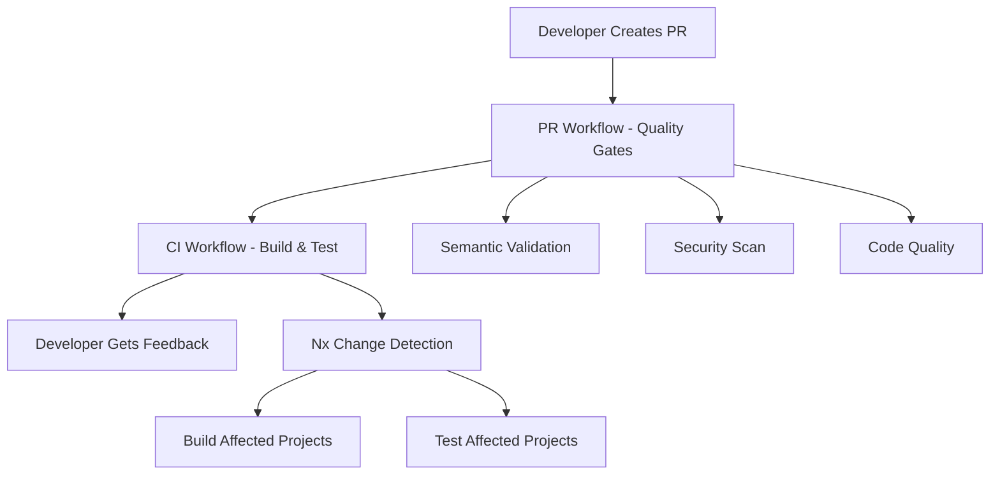
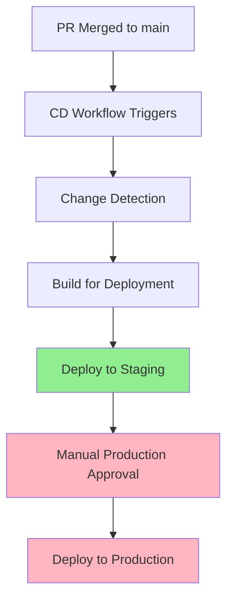
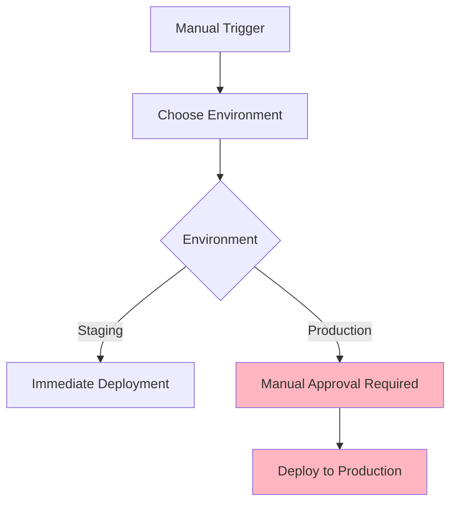
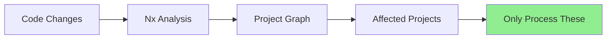

# GitHub Actions Setup

This directory contains the GitHub Actions workflows and configuration for our .NET monorepo.

## 📋 Quick Reference

| Workflow | Purpose | Triggers | Duration |
|----------|---------|----------|----------|
| **PR** | Quality gates & validation | PR events | 2-3 min |
| **CI** | Build & test affected projects | Push/PR to main/develop | 5-10 min |
| **CD** | Deploy to environments | Merge to main, manual | 3-8 min |

**Key Features:**
- ✅ **Intelligent change detection** - Only processes affected projects
- ✅ **Parallel execution** - Multiple projects build simultaneously  
- ✅ **Environment safety** - Staging first, manual production approval
- ✅ **Comprehensive validation** - Security, quality, and functional checks

## 🏗️ Architecture Overview

Our CI/CD pipeline uses a **three-tier workflow system** designed for efficiency, quality, and safety:

1. **PR Workflow** (`pr.yml`) - Fast quality gates and validation
2. **CI Workflow** (`ci.yml`) - Comprehensive build and test pipeline  
3. **CD Workflow** (`cd.yml`) - Safe deployment pipeline

### Directory Structure

```
.github/
├── workflows/
│   ├── ci.yml                    # Main CI pipeline
│   ├── cd.yml                    # Main CD pipeline  
│   ├── pr.yml                    # Pull request validation
│   └── templates/
│       ├── build-dotnet.yml      # Reusable .NET build template
│       ├── test-dotnet.yml       # Reusable .NET test template
│       └── deploy-app.yml        # Reusable app deployment template
├── scripts/
│   └── get-affected-projects.ps1 # PowerShell script for Nx affected
└── config/
    └── deployment-config.json    # Centralized deployment configuration
```

## 🔄 Workflow Lifecycles

### Lifecycle 1: New Pull Request

When a developer creates a PR:



**What happens:**
- **PR Workflow** (2-3 min): Validates PR title, checks conflicts, runs security scans, linting
- **CI Workflow** (5-10 min): Detects affected projects, builds and tests in parallel

### Lifecycle 2: PR Merged to Main

When a PR is merged:



**What happens:**
1. **Change Detection** (30s): Nx analyzes what changed
2. **Build** (2-5 min): Builds affected projects for deployment
3. **Staging** (1-2 min): Automatic deployment to staging
4. **Production** (Manual): Requires approval, then deploys

### Lifecycle 3: Emergency Deployment

Manual deployment outside normal flow:



## 🎯 Change Detection

Our workflows use **Nx-powered change detection** for efficiency:



**Example Scenarios:**

| Change Location | Affected Projects | Action |
|----------------|-------------------|---------|
| `libs/Shared/EchoService.cs` | Shared, EchoAPI | Build & test both |
| `apps/EchoAPI/Controllers/` | EchoAPI only | Build & test EchoAPI |
| `nx.json` | All projects | Build & test all |
| Documentation | None | Skip processing |

## 📊 Workflow Details

### PR Workflow (`pr.yml`)

**Purpose:** Fast quality gates and validation
**Triggers:** PR created/updated
**Duration:** 2-3 minutes

**Validations:**
- ✅ Semantic PR title (conventional commits)
- ✅ Merge conflict detection
- ✅ CodeQL security analysis
- ✅ NuGet dependency vulnerability scan
- ✅ Nx linting on all projects
- ⚠️ PR size warning (>1000 changes)

### CI Workflow (`ci.yml`)

**Purpose:** Comprehensive build and test validation
**Triggers:** Push to main/develop, PRs
**Duration:** 5-10 minutes

**Process:**
1. **Change Detection** - Nx identifies affected projects
2. **Parallel Build** - Builds affected projects simultaneously
3. **Parallel Test** - Tests affected projects with coverage
4. **Summary Report** - Comprehensive results summary

### CD Workflow (`cd.yml`)

**Purpose:** Safe deployment to environments
**Triggers:** Merge to main, manual dispatch
**Duration:** 3-8 minutes

**Process:**
1. **Change Detection** - Identifies what needs deployment
2. **Production Build** - Builds with production configuration
3. **Staging Deployment** - Automatic deployment to staging
4. **Production Deployment** - Manual approval required

## 🧩 Templates

### Build Template (`build-dotnet.yml`)

Reusable workflow for building .NET projects.

**Key Inputs:**
- `project-name`: Name of the project
- `project-path`: Path to project directory
- `project-type`: Type (webapi, classlib, etc.)
- `publish`: Whether to publish artifacts

### Test Template (`test-dotnet.yml`)

Reusable workflow for testing .NET projects.

**Key Inputs:**
- `project-name`: Name of the project
- `collect-coverage`: Whether to collect coverage

### Deploy Template (`deploy-app.yml`)

Reusable workflow for deploying applications.

**Key Inputs:**
- `app-name`: Name of the application
- `environment`: Target environment
- `deployment-type`: Type of deployment

## ⚙️ Configuration

### Deployment Configuration (`deployment-config.json`)

Centralized configuration for all projects:

```json
{
  "apps": {
    "EchoAPI": {
      "type": "webapi",
      "path": "apps/EchoAPI",
      "environments": ["dev", "staging", "prod"],
      "deployment": {
        "type": "azure-app-service",
        "resourceGroup": "my-rg",
        "appServiceName": "echo-api"
      }
    }
  },
  "libs": {
    "Shared": {
      "type": "classlib",
      "path": "libs/Shared",
      "publish": false
    }
  }
}
```

## 🔧 Scripts

### Get Affected Projects (`get-affected-projects.ps1`)

PowerShell script for Nx change detection.

**Usage:**
```powershell
pwsh .github/scripts/get-affected-projects.ps1 -BaseBranch main -HeadBranch HEAD
```

**Outputs:**
- `has-changes`: Whether projects were affected
- `matrix`: JSON matrix for GitHub Actions
- `affected-projects`: Comma-separated list

## 🚀 Performance & Caching

### Execution Times

| Workflow | Average Time | Parallel Jobs | Efficiency Gain |
|----------|--------------|---------------|-----------------|
| PR Validation | 2-3 minutes | 6 parallel | 3x faster |
| CI (2 projects) | 5-8 minutes | 4 parallel | 2x faster |
| CI (all projects) | 8-12 minutes | 6 parallel | 3x faster |
| CD Staging | 3-5 minutes | 2 parallel | 2x faster |
| CD Production | 5-8 minutes | 2 parallel | 2x faster |

### Caching Strategy

- **NuGet Cache**: `~/.nuget/packages` with hash-based keys
- **Nx Cache**: `.nx/cache` with configuration-based keys
- **Node Modules**: Built-in npm cache action

## 🔐 Environment Variables

### Required Secrets
- `AZURE_CREDENTIALS`: Azure service principal credentials
- `AZURE_WEBAPP_PUBLISH_PROFILE`: Azure App Service publish profile

### Optional Secrets
- `DOCKER_USERNAME`: Docker registry username
- `DOCKER_PASSWORD`: Docker registry password

## 🛠️ Operations

### Adding New Projects

1. **Update configuration** in `.github/config/deployment-config.json`
2. **Configure Nx** in `nx.json`
3. **Add deployment secrets** if needed

### Manual Deployment

1. Go to GitHub Actions → CD workflow
2. Click "Run workflow"
3. Choose environment (staging/production)
4. Optionally specify target application
5. Click "Run workflow"

## 🔍 Troubleshooting

### Common Issues

| Issue | Solution |
|-------|----------|
| **Nx change detection fails** | Check `fetch-depth: 0` in checkout action |
| **Build failures** | Verify .NET version and dependencies |
| **Deployment fails** | Check Azure credentials and permissions |
| **PR validation fails** | Ensure PR title follows conventional commits |

### Debugging

1. **Enable debug logging**: Set `ACTIONS_STEP_DEBUG=true` in secrets
2. **Check workflow logs**: Actions tab → failed workflow → job logs
3. **Test locally**: Use `npx nx affected:graph` and `npx nx build <project>`

## 📋 Best Practices

1. **Keep PRs focused** - Small, focused PRs build faster
2. **Use semantic commits** - Follow conventional commit format
3. **Test locally first** - Always test changes before pushing
4. **Monitor build times** - Regularly review and optimize
5. **Update dependencies** - Keep .NET and packages current

## 🔮 Future Enhancements

- [ ] Performance testing integration
- [ ] Blue-green deployment strategy
- [ ] Advanced monitoring integration
- [ ] Support for additional deployment targets
- [ ] Enhanced caching strategies 