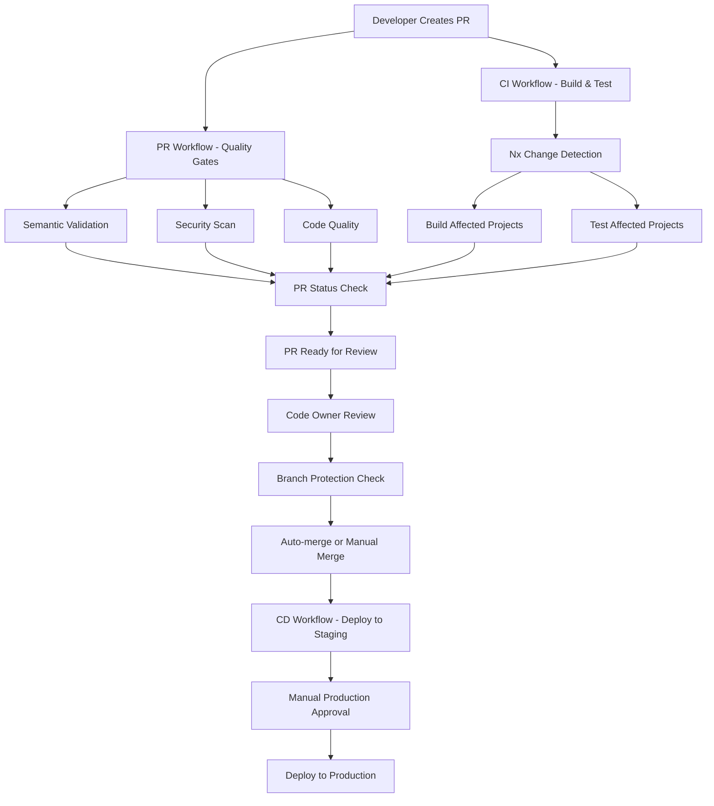

# GitHub Setup Requirements

## Overview

This document outlines the required GitHub configurations to ensure our CI/CD pipeline works correctly. These settings are essential for branch protection, environment management, and secure deployments.

## Table of Contents

1. [Branch Protection Rules](#branch-protection-rules)
2. [GitHub Environments](#github-environments)
3. [Repository Secrets](#repository-secrets)
4. [Code Owners](#code-owners)
5. [Repository Settings](#repository-settings)
6. [Workflow Integration](#workflow-integration)
7. [Troubleshooting](#troubleshooting)

## Branch Protection Rules

### Overview
Branch protection rules ensure that code cannot be merged until all required checks pass. This is critical for maintaining code quality and preventing broken code from reaching production.

### Required Configuration

Navigate to **Settings → Branches → Add rule** and configure the following for both `main` and `develop` branches:

#### 1. Branch Name Pattern
```
main
develop
```

#### 2. Required Status Checks

**PR Validation Workflow Checks:**
- ✅ `validate-pr` - Semantic PR title validation
- ✅ `check-conflicts` - Merge conflict detection
- ✅ `security-scan` - CodeQL security analysis
- ✅ `dependency-check` - NuGet vulnerability scan
- ✅ `code-quality` - Nx linting checks
- ✅ `size-check` - PR size validation

**CI Workflow Checks:**
- ✅ `detect-changes` - Nx change detection
- ✅ `build` - Build affected projects
- ✅ `test` - Test affected projects
- ✅ `check-results` - Final validation

#### 3. Additional Settings

**General Settings:**
- ✅ **Require branches to be up to date** before merging
- ✅ **Require pull request reviews** before merging
- ✅ **Require review from code owners** (if CODEOWNERS file exists)
- ✅ **Dismiss stale PR approvals** when new commits are pushed
- ✅ **Require status checks to pass** before merging

**Optional Settings:**
- ✅ **Restrict pushes that create files** (prevents direct file creation)
- ✅ **Require linear history** (enforces clean commit history)
- ✅ **Include administrators** (applies rules to repo admins too)

### Configuration Steps

1. Go to your repository on GitHub
2. Navigate to **Settings → Branches**
3. Click **Add rule**
4. Enter branch name pattern: `main`
5. Configure all required status checks
6. Enable additional settings as needed
7. Click **Create**
8. Repeat for `develop` branch

## GitHub Environments

### Overview
GitHub Environments provide deployment protection and approval workflows. They're essential for controlling deployments to different environments.

### Required Environments

#### 1. Production Environment

**Create Environment:**
- Go to **Settings → Environments**
- Click **New environment**
- Name: `production`

**Configuration:**
- ✅ **Required reviewers** - Add team members who can approve production deployments
- ✅ **Wait timer** - Optional delay before deployment (recommended: 5 minutes)
- ✅ **Deployment branches** - Restrict to `main` branch only
- ✅ **Environment protection rules** - Prevent bypassing required reviewers

**Reviewers:**
- Add senior developers or DevOps team members
- Minimum 1 reviewer required
- Consider requiring 2 reviewers for critical deployments

#### 2. Staging Environment

**Create Environment:**
- Go to **Settings → Environments**
- Click **New environment**
- Name: `staging`

**Configuration:**
- ✅ **Deployment branches** - Allow `main` branch
- ⚠️ **No required reviewers** (automatic deployment)
- ✅ **Environment protection rules** - Optional additional checks

### Environment Variables (Optional)

You can add environment-specific variables:

**Production:**
```
ENVIRONMENT=production
LOG_LEVEL=warning
FEATURE_FLAGS=production-only-features
```

**Staging:**
```
ENVIRONMENT=staging
LOG_LEVEL=info
FEATURE_FLAGS=staging-features
```

## Repository Secrets

### Overview
Repository secrets store sensitive information like credentials and API keys. These are encrypted and only accessible to workflows.

### Required Secrets

#### Azure Deployment Secrets

**AZURE_CREDENTIALS**
- **Purpose:** Azure service principal credentials for deployment
- **Format:** JSON service principal credentials
- **How to create:**
  1. Go to Azure Portal → Azure Active Directory → App registrations
  2. Create new registration
  3. Generate client secret
  4. Assign appropriate roles (Contributor on resource group)
  5. Download credentials as JSON

**AZURE_WEBAPP_PUBLISH_PROFILE**
- **Purpose:** Azure App Service publish profile
- **Format:** XML publish profile
- **How to create:**
  1. Go to Azure Portal → App Service
  2. Select your app service
  3. Go to Overview → Get publish profile
  4. Download the .PublishSettings file
  5. Copy the content

#### Optional Secrets

**DOCKER_USERNAME**
- **Purpose:** Docker registry username
- **Format:** String

**DOCKER_PASSWORD**
- **Purpose:** Docker registry password
- **Format:** String

### Adding Secrets

1. Go to **Settings → Secrets and variables → Actions**
2. Click **New repository secret**
3. Enter name and value
4. Click **Add secret**

### Security Best Practices

- ✅ **Rotate secrets regularly** (every 90 days)
- ✅ **Use least privilege** for service principals
- ✅ **Monitor secret usage** in audit logs
- ✅ **Never commit secrets** to repository
- ✅ **Use environment-specific secrets** when possible

## Code Owners

### Overview
CODEOWNERS file automatically requests reviews from specific team members when files in their areas are changed.

### Configuration

Create `.github/CODEOWNERS` file:

```gitignore
# Global code owners
* @your-team-name

# API team owns echo-api
apps/echo-api/ @api-team

# Shared libraries team
libs/shared/ @shared-libs-team

# Infrastructure and deployment
.github/ @devops-team
.github/workflows/ @devops-team

# Documentation
docs/ @tech-writers
README.md @tech-writers

# Configuration files
*.json @devops-team
*.yml @devops-team
*.yaml @devops-team
```

### Code Owner Rules

- **One owner per line** - Multiple owners on same line
- **Order matters** - Last matching pattern wins
- **Use teams** - `@team-name` for team ownership
- **Use individuals** - `@username` for individual ownership
- **Wildcards supported** - `*` for all files, `**/` for directories

## Repository Settings

### General Settings

Navigate to **Settings → General**:

**Pull Requests:**
- ✅ **Allow auto-merge** (automatic merging when all checks pass)
- ✅ **Automatically delete head branches** (clean up after merge)
- ✅ **Allow squash merging** (recommended for clean history)
- ✅ **Allow rebase merging** (alternative to squash)
- ⚠️ **Allow merge commits** (optional, can be disabled)

**Issues:**
- ✅ **Allow forking** (if you want to allow public contributions)
- ✅ **Allow issues** (enable issue tracking)

### Pull Request Settings

Navigate to **Settings → Pull Requests**:

**General:**
- ✅ **Allow auto-merge**
- ✅ **Automatically delete head branches**
- ✅ **Allow squash merging**
- ✅ **Allow rebase merging**

**Pull request reviews:**
- ✅ **Dismiss stale PR approvals** when new commits are pushed
- ✅ **Require review from code owners**
- ✅ **Require review of the latest push**

## Workflow Integration

### How Workflows Work Together



### Status Check Integration

**PR Validation Workflow:**
- Runs on PR creation/update
- Provides fast feedback (2-3 minutes)
- Blocks merge if any check fails

**CI Workflow:**
- Runs on PR creation/update
- Comprehensive build and test (5-10 minutes)
- Blocks merge if any check fails

**CD Workflow:**
- Runs on merge to main
- Deploys to staging automatically
- Requires manual approval for production

### Branch Protection Integration

**Before Merge:**
1. All required status checks must pass
2. PR must be up to date with base branch
3. Required number of reviews must be completed
4. Code owner approval must be received (if applicable)

**After Merge:**
1. Head branch is automatically deleted
2. CD workflow triggers automatically
3. Staging deployment begins
4. Production deployment requires manual approval

## Troubleshooting

### Common Issues

#### Branch Protection Issues

**Problem:** "Required status checks are not expected"
- **Solution:** Ensure all workflow jobs are properly named and configured
- **Check:** Verify job names in workflow files match branch protection rules

**Problem:** "Branch is out of date"
- **Solution:** Update branch with latest changes from base branch
- **Command:** `git pull origin main` or use GitHub's "Update branch" button

#### Environment Issues

**Problem:** "Environment protection rules pending"
- **Solution:** Ensure required reviewers are available and have been notified
- **Check:** Verify environment configuration and reviewer assignments

**Problem:** "Environment not found"
- **Solution:** Create the required environment in repository settings
- **Check:** Verify environment name matches workflow configuration

#### Secret Issues

**Problem:** "Secret not found"
- **Solution:** Add the required secret to repository settings
- **Check:** Verify secret name matches workflow configuration

**Problem:** "Invalid credentials"
- **Solution:** Rotate the secret with new credentials
- **Check:** Verify credentials have correct permissions

### Debug Steps

1. **Check workflow logs** - Go to Actions tab and review failed workflow
2. **Verify branch protection** - Check Settings → Branches
3. **Review environment settings** - Check Settings → Environments
4. **Validate secrets** - Check Settings → Secrets and variables
5. **Test locally** - Run `npx nx affected:graph` to verify change detection

### Getting Help

- **GitHub Actions documentation** - [docs.github.com/en/actions](https://docs.github.com/en/actions)
- **Branch protection documentation** - [docs.github.com/en/repositories/configuring-branches-and-merges-in-your-repository/defining-the-mergeability-of-pull-requests/about-protected-branches](https://docs.github.com/en/repositories/configuring-branches-and-merges-in-your-repository/defining-the-mergeability-of-pull-requests/about-protected-branches)
- **Environment documentation** - [docs.github.com/en/actions/deployment/targeting-different-environments/using-environments-for-deployment](https://docs.github.com/en/actions/deployment/targeting-different-environments/using-environments-for-deployment)

## Next Steps

1. **Configure branch protection rules** (highest priority)
2. **Set up GitHub environments** for production approval
3. **Add required secrets** for deployment
4. **Create CODEOWNERS file** for team ownership
5. **Test the workflow** by creating a test PR
6. **Monitor and optimize** build times and deployment processes

## Checklist

### Branch Protection
- [ ] Configure protection for `main` branch
- [ ] Configure protection for `develop` branch
- [ ] Add all required status checks
- [ ] Enable additional protection settings

### Environments
- [ ] Create `production` environment
- [ ] Create `staging` environment
- [ ] Configure required reviewers for production
- [ ] Set deployment branch restrictions

### Secrets
- [ ] Add `AZURE_CREDENTIALS` secret
- [ ] Add `AZURE_WEBAPP_PUBLISH_PROFILE` secret
- [ ] Add optional Docker secrets if needed
- [ ] Verify secret permissions

### Code Owners
- [ ] Create `.github/CODEOWNERS` file
- [ ] Define team ownership for different areas
- [ ] Test code owner assignment

### Repository Settings
- [ ] Configure pull request settings
- [ ] Enable auto-merge if desired
- [ ] Set up branch cleanup
- [ ] Configure merge strategies

### Testing
- [ ] Create test PR to verify workflow
- [ ] Test branch protection rules
- [ ] Verify environment approval process
- [ ] Test deployment to staging
- [ ] Test manual production deployment 